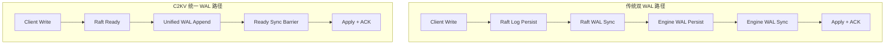
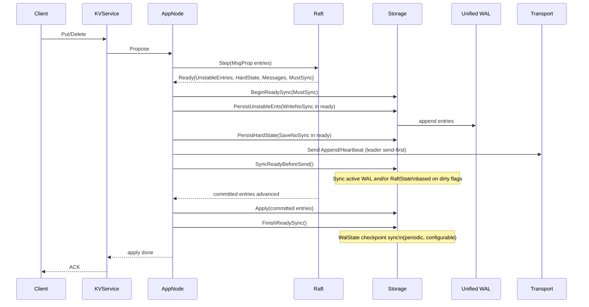
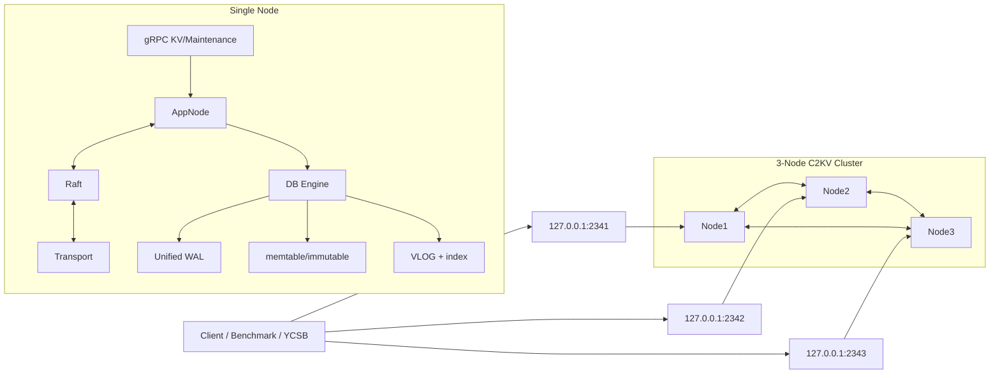
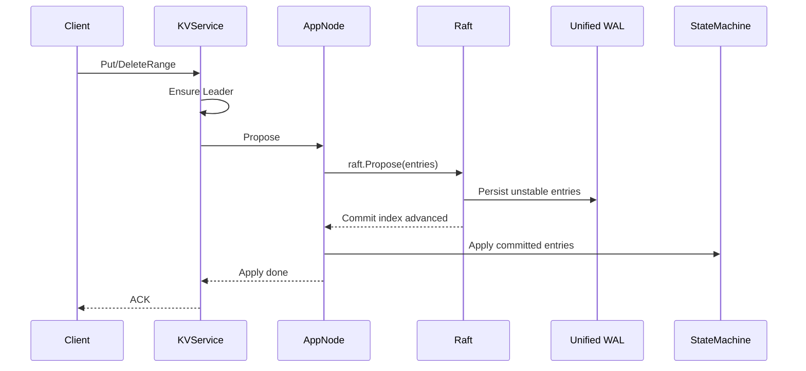

# C2KV

`C2KV` 是一个基于 Go 的分布式 KV 项目，核心目标是验证并工程化落地“统一 WAL（合并 Raft WAL + Engine WAL）”这条路径。

一句话定位：在可比语义下，尽量把写路径做得比 etcd 更短、更稳、更容易 pipeline 化。  
核心卖点：把 `Raft WAL + Engine WAL` 合并为一条统一日志，并在 Ready 阶段做统一同步决策。

## 为什么做统一 WAL

传统“双 WAL”架构常见问题是写路径状态分裂、同步点偏多、调优复杂度高。  
C2KV 通过统一 WAL 把持久化路径收敛到一处，主要收益是：

- 降低写放大与同步阶段切换成本
- 便于做 Ready 级批处理和 group commit
- 便于把“网络复制”和“本地持久化”重叠执行
- 在 strict durability 模式下更容易做到“可解释的性能优化”

更完整的性能归因与对标过程见 `doc/perf-optimization.md`。

## 统一 WAL 是怎么实现的

### 1) 双 WAL 与统一 WAL 的实现差异



要点：

- 双 WAL 通常有两套日志写入/同步决策，状态分散，调优难。
- C2KV 把 Raft entries 与引擎写入元信息收敛到统一 WAL 路径。
- 同步策略在 Ready 生命周期内统一决策（而不是每个子步骤各自 sync）。

### 2) C2KV 一轮 Ready 的关键时序（Leader）



### 3) 为什么这件事能更快

- 让多个持久化动作在同一 Ready 下聚合，减少重复同步。
- leader 路径采用 `send -> sync`，复制与本地落盘可以重叠。
- 与提案微批/WAL 批编码/传输批发送叠加后，吞吐和 p99 更稳定。
- 同时保留 `always|batch|none` 三种模式，便于 strict 与 peak 两套口径对比。


## 项目结构

- 服务端入口：`cmd/c2kv`
- 客户端入口：`cmd/c2kvctl`
- 协议定义：`api/proto`
- 生成代码：`api/gen`
- 服务端实现：`internal`
- 可复用客户端：`pkg/client`
- 部署配置：`deploy`
- 评测工具：`eval`
- 运行输出：`var`
- 设计与性能文档：`doc`

## 架构图



## 写路径时序（Leader）



## 当前能力

- 3 节点 Raft 集群可稳定选主
- 支持 `Put` / `Range` / `DeleteRange` 基本链路
- 写请求使用 leader 路径（follower 返回 `not leader`）
- 支持 `eval/benchmark` 与 `eval/ycsb-runner` 两套压测
- 支持 `syncMode=always|batch|none` 的 WAL 持久化策略

## 快速开始

### 1) 依赖

- Docker / Docker Compose
- Go 1.24+

网络受限时可设置代理：

```bash
export https_proxy=http://127.0.0.1:1080
export http_proxy=http://127.0.0.1:1080
```

### 2) 启动 C2KV 3 节点

```bash
cd C2KV
make dev_build
```

等价命令：

```bash
docker compose -f deploy/dev/compose_dev.yaml -p c2kv-dev up -d --build
```

默认 gRPC 端口：

- `127.0.0.1:2341`
- `127.0.0.1:2342`
- `127.0.0.1:2343`

### 3) 烟雾验证

```bash
go run ./eval/benchmark put \
  --endpoints=127.0.0.1:2341,127.0.0.1:2342,127.0.0.1:2343 \
  --target-leader \
  --clients=8 \
  --total=5000 \
  --val-size=128
```

### 4) 简易 CLI 验证

```bash
go run ./cmd/c2kvctl -i 127.0.0.1:2341 -k k1 -v v1
```

## C2KV vs etcd Benchmark

### 基准结果快照

测试口径：

- 工具：YCSB `workloada`（`read/update=50/50`）
- 集群：3 节点 C2KV vs 3 节点 etcd（`v3.5.13`）
- 环境：同容器资源限制，同一宿主机

| 指标 | C2KV | etcd | 相对变化 |
| --- | ---: | ---: | ---: |
| TOTAL OPS | 7897.94 | 4730.36 | +66.96% |
| UPDATE OPS | 3933.84 | 2372.24 | +65.83% |
| UPDATE p99(us) | 11994.20 | 15477.40 | 改善 22.51% |
| Error Rate | 0.0000% | 0.0000% | - |

矩阵汇总（`clients={1,16,64}`，`val={16B,128B,1KB}`，每组 5 次）：

- 9 组中 C2KV 吞吐领先 6 组（基于 `matrix_summary_clean.csv`）
- 平均 TOTAL 增益：`+22.83%`
- 平均 UPDATE 增益：`+25.00%`

说明：

- 优势主要集中在中高并发和较大 value 场景。
- 低并发小 value 场景不保证领先，这是固定开销占比导致的正常现象。
- 原始结果与分析见 `doc/perf-optimization.md` 及 `var/bench-results/**`。

### 1) 启动 etcd 3 节点（固定 v3.5.13）

```bash
docker compose -f eval/docker-compose.etcd.yml up -d
```

默认 etcd client 端口：

- `127.0.0.1:2379`
- `127.0.0.1:22379`
- `127.0.0.1:32379`

### 2) 运行 YCSB 单组对比

```bash
cd eval/ycsb-runner
RUN_TAG=quick-compare \
THREADS=16 \
REPEATS=3 \
./scripts/run_compare_c2kv_etcd.sh
```

输出目录：

- `var/bench-results/ycsb-compare/<RUN_TAG>/summary.csv`
- `var/bench-results/ycsb-compare/<RUN_TAG>/report.md`

### 3) 运行矩阵对比（推荐）

```bash
cd eval/ycsb-runner
CLIENTS_LIST="1 16 64" \
VAL_SIZES="16 128 1024" \
REPEATS=5 \
./scripts/run_compare_matrix.sh
```

矩阵汇总输出：

- `var/bench-results/ycsb-matrix/<MATRIX_TAG>/matrix_summary.csv`

## WAL 持久化模式

配置项位于 `dbConfig.walConfig`：

- `syncMode=always`：每轮写入后同步落盘，适合 strict 对标
- `syncMode=batch`：按 `syncIntervalMs` 批量同步
- `syncMode=none`：不主动同步，仅用于峰值探索

注意：即使使用 Direct I/O，也不等价于崩溃一致性语义；对比 etcd 时建议优先看 `always` 结果。

## 开发与测试

```bash
# 主模块
go test ./...

# 重点路径（建议）
go test -race ./internal/app/... ./internal/db/... ./internal/raft/... ./internal/transport/...

# ycsb-runner 子模块
cd eval/ycsb-runner && go test ./...
```


## 参考文档

- benchmark CLI：`eval/benchmark/README.md`
- ycsb runner：`eval/ycsb-runner/README.md`

## 停止集群

```bash
docker compose -f deploy/dev/compose_dev.yaml -p c2kv-dev down
docker compose -f eval/docker-compose.etcd.yml down
```
